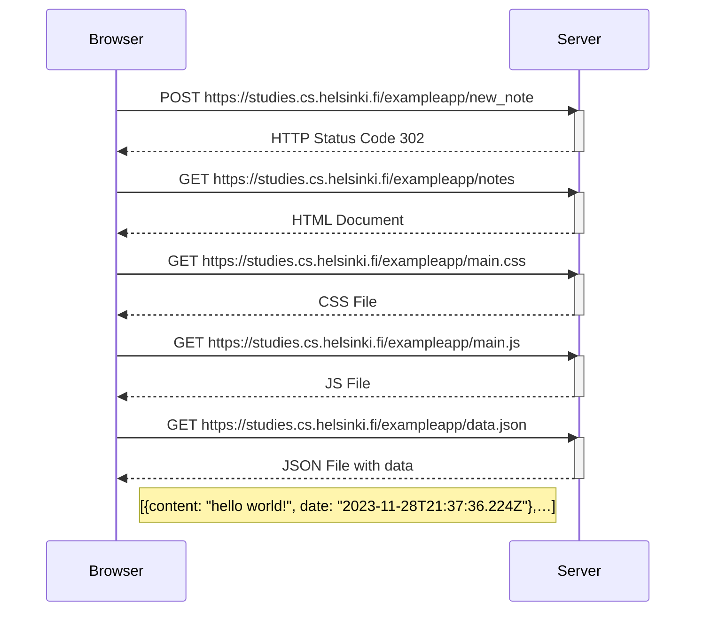
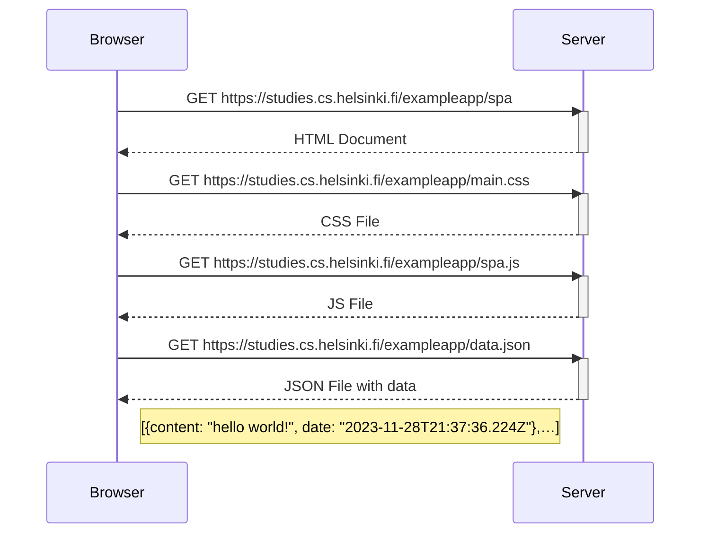
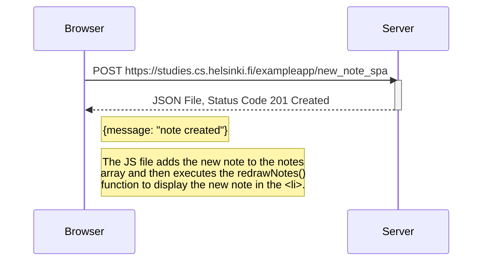

# Full Stack Open 2023
_Fullstackopen_  course by University of Helsinki
https://fullstackopen.com/es/

## Índice

### Part   0: Fundamentos de las aplicaciones web.

#### 0.1: HTML
> Revisa los conceptos básicos de HTML leyendo este tutorial de Mozilla: tutorial HTML.

#### 0.2: CSS
> Revisa los conceptos básicos de CSS leyendo este tutorial de Mozilla: tutorial CSS.

#### 0.3: Formularios HTML
> Aprende sobre los conceptos básicos de los formularios HTML leyendo el tutorial de Mozilla Mi primer formulario HTML.

#### 0.4: Nuevo diagrama de nota

> Crea un diagrama similar que describa la situación en la que el usuario crea una nueva nota en la página [https://studies.cs.helsinki.fi/exampleapp/notes](https://studies.cs.helsinki.fi/exampleapp/notes) escribiendo algo en el campo de texto y haciendo clic en el botón _Save_.

#### 0.5: Diagrama de aplicación de una sola página

> Crea un diagrama que describa la situación en la que el usuario accede a la versión de aplicación de una sola página de la aplicación de notas en https://studies.cs.helsinki.fi/exampleapp/spa.

#### 0.6: Nueva nota en diagrama de aplicación de una sola pagina

> Crea un diagrama que represente la situación en la que el usuario crea una nueva nota utilizando la versión de una sola página de la aplicación.

### Part 1: