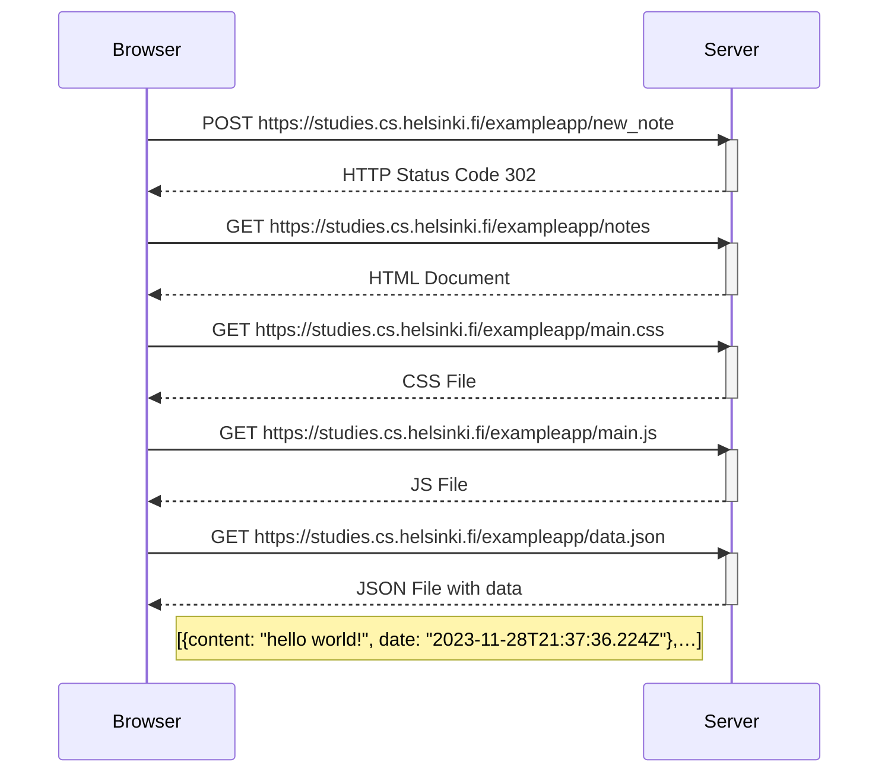

# Full Stack Open 2023
_Fullstackopen_  course by University of Helsinki
https://fullstackopen.com/es/

## Índice

### Part 0: Fundamentos de las aplicaciones web.

#### 0.4: Nuevo diagrama de nota

**Crea un diagrama similar** que describa la situación en la que el usuario crea una nueva nota en la página [https://studies.cs.helsinki.fi/exampleapp/notes](https://studies.cs.helsinki.fi/exampleapp/notes) escribiendo algo en el campo de texto y haciendo clic en el botón _Save_.

### Part 1: